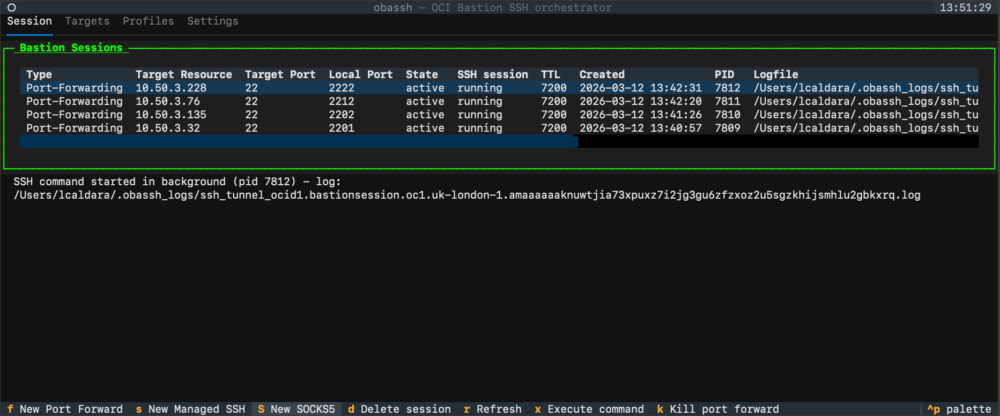
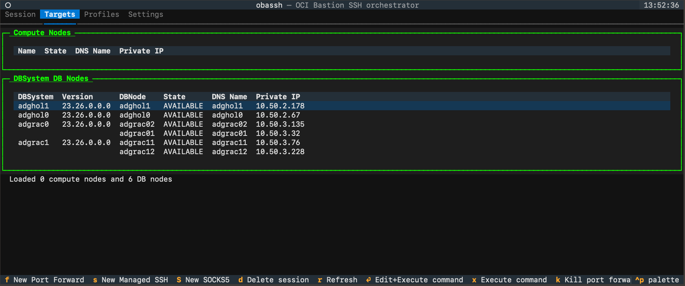
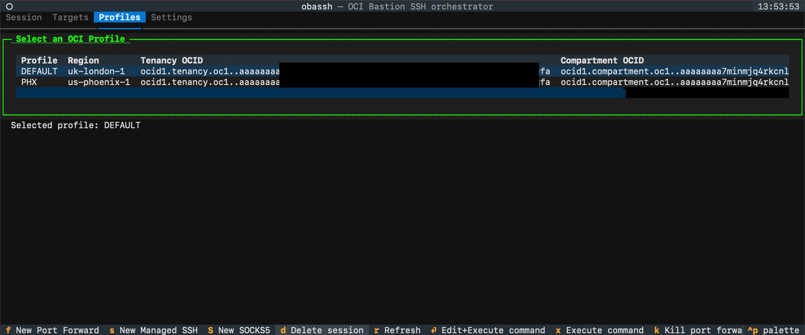
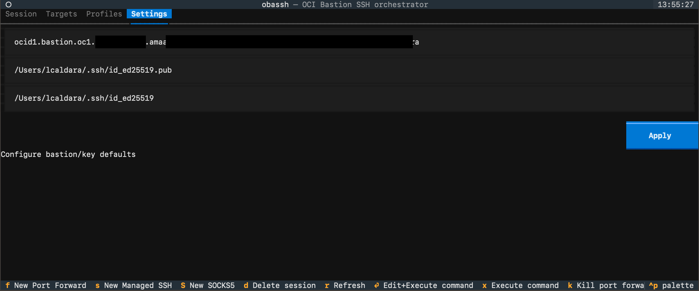
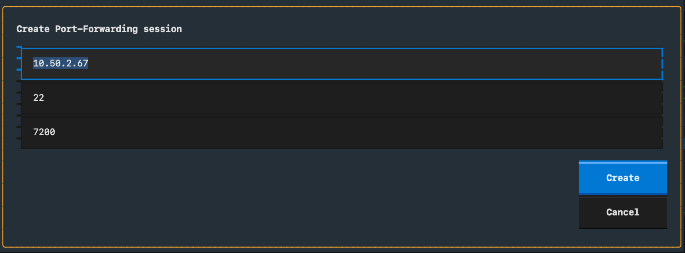
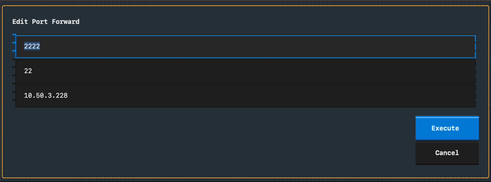

# obassh

`obassh` is a Textual (terminal UI) app to discover OCI targets and create/manage OCI Bastion sessions for:

- Managed SSH
- Local port forwarding
- Dynamic SOCKS5 forwarding

It helps you avoid manually building long OCI + SSH command lines.

## Current status

This project is in active development (`0.1.0`) and currently focuses on OCI profile/target discovery and bastion session workflows.

---

## Prerequisites

- Python `>=3.11`
- OCI account and permissions for Bastion / Compute / Database discovery
- OCI config files configured locally:
  - `~/.oci/config`
  - `~/.oci/oci_cli_rc` (optional but recommended for default compartment)
- SSH key pair available in `~/.ssh` (for example `id_ed25519` + `id_ed25519.pub`)

Optional environment variable:

- `COMPID` to force a compartment OCID (overrides values from `oci_cli_rc`)

---

## Installation

From the repository root:

```bash
python -m venv .venv
source .venv/bin/activate
pip install -U pip
pip install -e .
```

---

## Run the app

After installation, run:

```bash
obassh
```

If you added/updated the project in an existing virtualenv, refresh editable install once:

```bash
pip install -e .
```

---

## Quick usage flow

1. Open **Profiles** tab and select your OCI profile.
2. App loads Compute and DB targets from your selected/default compartment.
3. In **Settings**, optionally set:
   - Bastion OCID override
   - Public/private SSH key paths
4. Create a new session:
   - `s` for Managed SSH
   - `f` for Port Forward
   - `S` for SOCKS5
5. Wait for session state to become `ACTIVE`.
6. Execute connection command:
   - `enter` to edit + execute
   - `x` to execute command flow directly
7. For forwarded sessions, you can kill running tunnel process with `k`.

---

## Keyboard shortcuts

- `f` → New Port Forward
- `s` → New Managed SSH
- `S` → New SOCKS5
- `d` → Delete selected session
- `r` → Refresh targets/sessions
- `enter` → Edit + execute command
- `x` → Execute command
- `k` → Kill running port-forward process

---

## Run tests

```bash
pytest
```

---

## Screenshots (placeholders)

> Add your screenshots to `docs/screenshots/` and keep these filenames (or update links).

### Main session view



### Targets view



### Profiles view



### Settings view



### Create port-forward session modal



### Execute port-forward SSH modal



---

## Notes / troubleshooting

- If no targets are loaded, verify compartment resolution (`COMPID` or `~/.oci/oci_cli_rc`).
- If no bastion is auto-selected, configure one in **Settings** or ensure exactly one bastion exists in the compartment.
- Session creation/discovery errors are surfaced in the UI status area.
